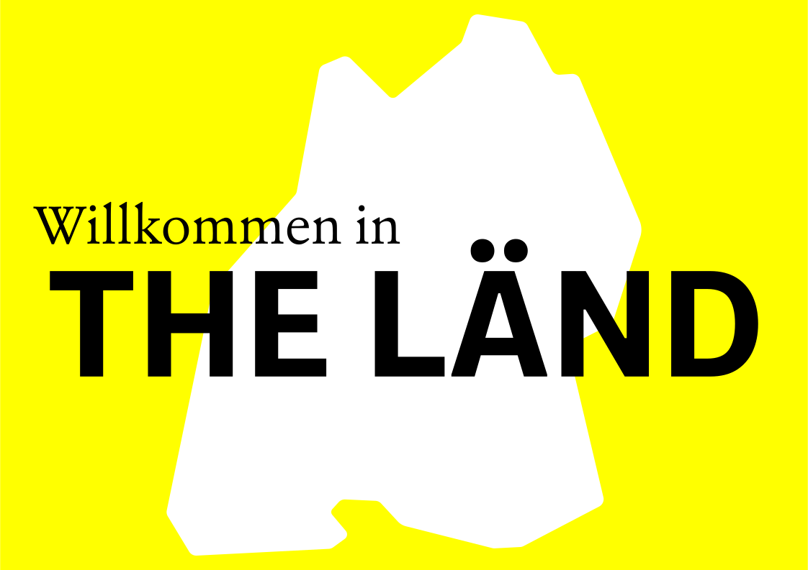
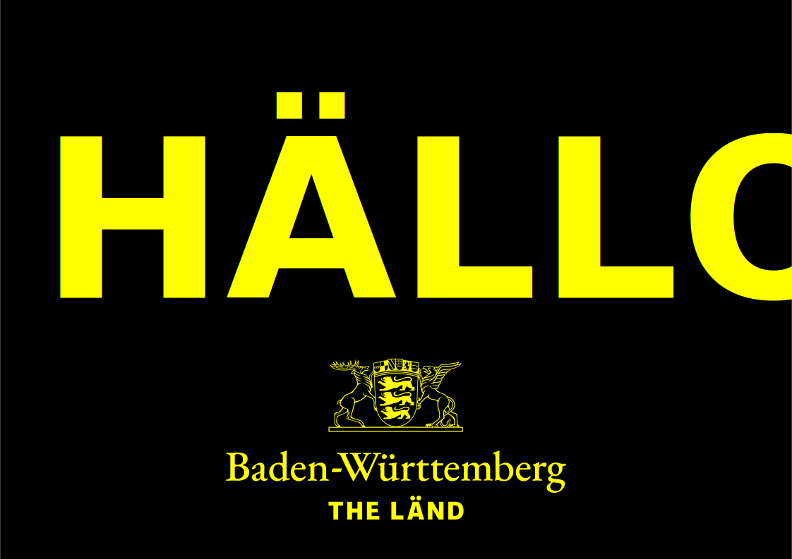
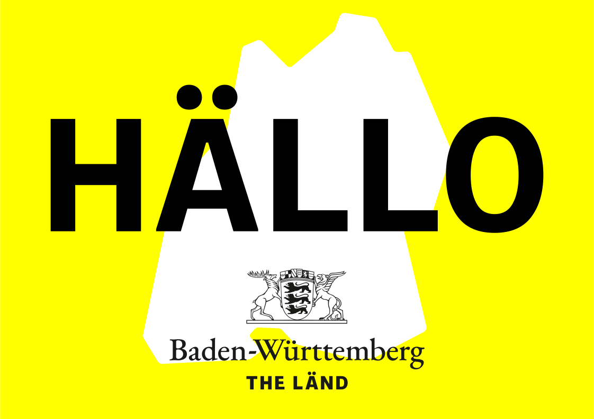
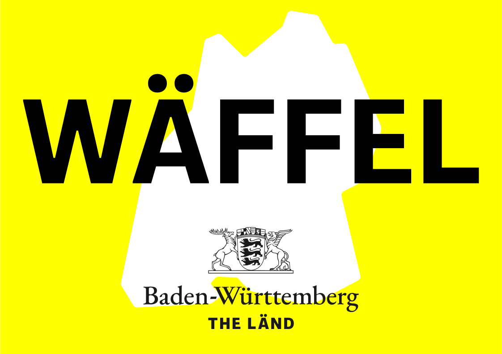

 THE LÄND print-propaganda
============================
THE LÄND Propaganda for regular 2D Printing (inofficial)

 Disclaimer
------------
The graphics, works and other digital content collected here are for artistic purposes only. More Information about this on [baden-wuerttemberg.de](https://www.baden-wuerttemberg.de/de/unser-land/landeswappen-und-hymnen/landeswappen/). For License Information have a look at [this](https://de.wikipedia.org/wiki/Wappen_Baden-Württembergs#/media/Datei:Greater_coat_of_arms_of_Baden-Württemberg.svg) Wikipedia entry.

 FÖNT
------
+ The [Referenz Grotesk](https://www.fontsdownload.org/referenz-grotesk-font-family/) Font is used for the **THE LÄND**.
+ The [Gueda](https://www.1001freefonts.com/gudea.font) Font is used sometimes...
+ The [Garamont Amsterdam Regular](https://fontsgeek.com/fonts/Garamont-Amsterdam-BQ-Regular) and the [Erato Regular](https://www.fontshmonts.com/text-fonts/erato/) Font is used for *Baden Württemberg*.

 Nice to knöw:
--------------
There is a Makefile to create PDF's and PNG's using ``inkscape`` in the root of this repo.

 Some signs:
-------------

